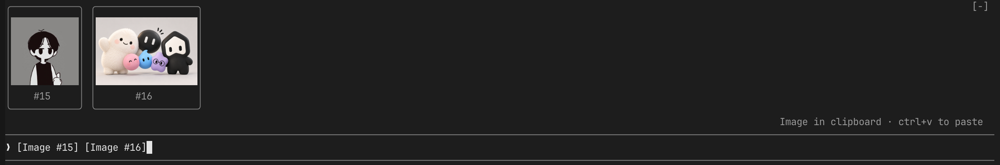

# claude-mods-image-preview

English | [한국어](README.ko.md)

A Claude Code mod that shows thumbnails of pasted images right above the prompt, in any terminal.



Terminals without image support get the same layout in colored half-blocks:

```
╭────────────╮ ╭────────────────────────╮
│▀▀▀▀▀▀▀▀▀▀▀▀│ │▀▀▀▀▀▀▀▀▀▀▀▀▀▀▀▀▀▀▀▀▀▀▀▀│
│▀▀▀▀▀▀▀▀▀▀▀▀│ │▀▀▀▀▀▀▀▀▀▀▀▀▀▀▀▀▀▀▀▀▀▀▀▀│
│▀▀▀▀▀▀▀▀▀▀▀▀│ │           #2           │
│     #1     │ ╰────────────────────────╯
╰────────────╯
❯ [Image #1] [Image #2] compare these two screens
```

## Install

Type this at the prompt of a Claude Code terminal session:

```
/plugin install mods-image-preview --marketplace hahmjuntae/claude-mods-image-preview
```

1. Answer `y` to `Add marketplace?`.
2. Pick a scope. The user scope is the default.
3. When `Installed mods-image-preview. Plugin is now active.` appears, the mod is running in the current session.

Requires a Claude Code build with function-hook mods. Tested on Claude Code 2.1.292.

## How it works

| Step | What happens |
|---|---|
| Detect | Reads the prompt draft every 300 ms and looks for `[Image #N]` tokens |
| Source | Reads `images/N.*`, which Claude Code writes to the session temp folder the moment you paste |
| Draw | Renders a thumbnail with the best renderer your terminal supports (see below) |
| Clear | Thumbnails disappear when you delete the token or submit the prompt |

## Renderers

| Terminal | Thumbnail |
|---|---|
| kitty, Ghostty (outside tmux, screen and SSH) | Real pixels through the kitty graphics protocol |
| A terminal that advertises the overlay (see Terminal integration), tmux included | Real pixels drawn by the terminal over marker cells |
| Everything else: iTerm2, Terminal.app, WezTerm, Alacritty, Windows Terminal, VS Code, tmux, screen, SSH | Colored half-block characters (`▀` `▄`) |

If a terminal looks like kitty but does not answer the graphics query, the mod switches to half-blocks on its own.

Inside tmux, Claude Code does not send kitty graphics, and it rejects the kitty Unicode placeholder character (`U+10EEEE`) that tmux image passthrough relies on. So inside tmux the thumbnail is drawn with half-blocks unless the outer terminal supports the overlay.

## Settings

Change them in `/config`.

| Name | Values | Default |
|---|---|---|
| `renderer` | `auto`, `blocks`, `pixels`, `overlay` | `auto` |
| `size` | `small` 16x4, `medium` 24x6, `large` 40x10 (terminal cells) | `medium` |

`auto` picks the overlay when the terminal advertises it, pixels on kitty and Ghostty, and half-blocks everywhere else.

## Supported formats

| Format | Handling |
|---|---|
| PNG | Built-in decoder: 1/2/4/8/16-bit, palette, transparency, interlaced |
| JPEG, GIF, WebP, HEIC and others | Converted to a small PNG with macOS `sips` |
| PNG over 4 MiB | Downscaled with macOS `sips` |

Outside macOS, formats other than PNG show `unsupported`.

## Terminal integration

A terminal can show real pixels even inside tmux by drawing an image over marker cells.

1. Advertise the overlay by setting `CLAUDE_MODS_IMAGE_OVERLAY=1` in the environment of the shells it starts. Inside tmux, the mod also accepts the same variable in the tmux global environment (`tmux set-environment -g CLAUDE_MODS_IMAGE_OVERLAY 1`), so panes that were already open pick it up.
2. The mod draws marker cells in place of the thumbnail and links the source image to `~/.claude/claude-mods-image-preview/<id as five hex digits>`.
3. The terminal scans its screen for marker cells, groups them by id and draws the linked image over them.

| Field | Encoding |
|---|---|
| Glyph | `U+2800 + (row << 4 \| rows - 1)`, row counted from 0, at most 16 rows |
| Foreground | Nibbles `0xA`, `id[19:16]`, `id[15:12]`, each written as channel value `nibble × 17` |
| Background | Nibbles `id[11:8]`, `id[7:4]`, `id[3:0]`, each written as channel value `nibble × 17` |
| id | Low 20 bits of the FNV-1a 32-bit hash of the source path |

The Claude Code `Raster` palette keeps channel values that are multiples of 17, so the markers pass through tmux unchanged.

## Development

```
claude plugin validate .
claude plugin test .
```

## License

MIT
